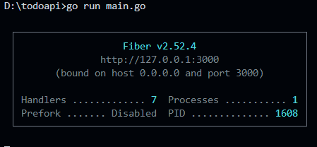
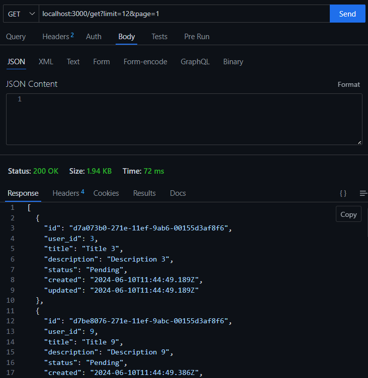
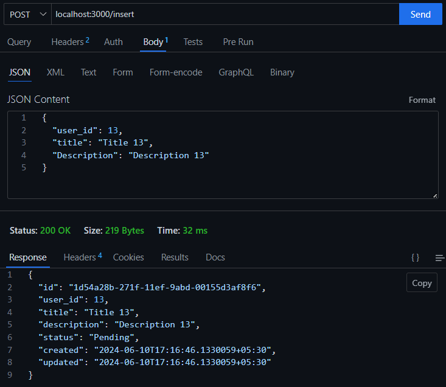
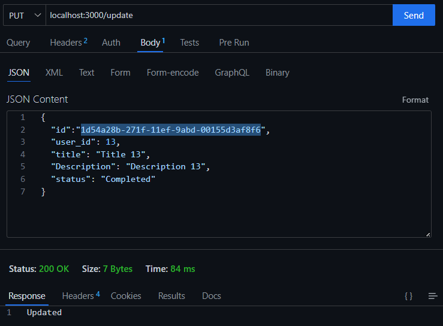
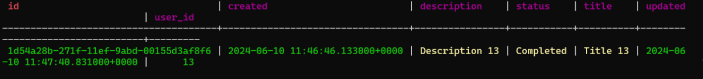
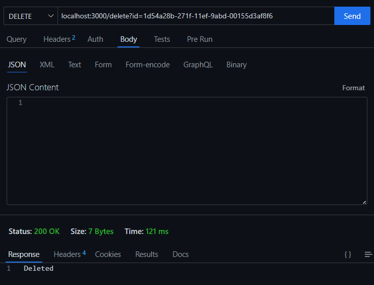
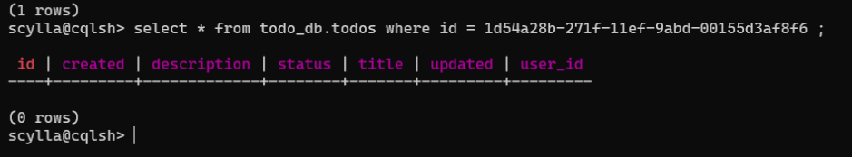

# API Implementation for TODO APP supporting CRUD Operations using Golang and ScyllaDB 
## Introduction

This is a simple API implementation for a TODO APP using Golang and ScyllaDB. The API supports CRUD operations for the TODO APP. The API is implemented using the Go fiber framework for Golang and the ScyllaDB driver for Golang. 

## Prerequisites

- Golang
- ScyllaDB Cloud
- Docker (For Interacting with the ScyllaDB using cqlsh)

## Libraries Used

- Fiber
- ScyllaDB Driver for Golang
- Validator 

## Installation

1. Clone the repository
```bash
git clone github.com/kartikchhipa/todoapi
```
2. Run the following command to install the dependencies
```bash
go mod tidy
```
3. Change the ScyllaDB connection details in the main.go file
```go
cluster := gocql.NewCluster("scylla-xxxxx.scylladb.cloud")
cluster.Authenticator = gocql.PasswordAuthenticator{Username: "username", Password: "password"}
```
4. Run the following command to start the server
```bash
go run main.go
```

## API Endpoints

1. GET /get - Get the list of TODO items in paginated form. The default page size (Number of Results in a page) is 10. The page number can be specified in the query parameter as `page`. If the value defined by `page` is less than `defaultPageSize` it will become equal to `defaultPageSize` and if it is more than `maxPageSize` it will become equal to `maxPageSize`. Pagination is performed by using `PageSize` and `PageState` methods from the ScyllaDB driver for Golang. The get method also supports the parameter `status` which can be used to filter the TODO items based on their status. The status can be `Completed`, `Pending`, or `In Progress`.

2. POST /insert - Add a new TODO item. The request body should contain the following fields:
```json
{
    "user_id": "1",
    "title": "Title",
    "description": "Description",
}
```

3. PUT /update - Update an existing TODO item. The request body should contain the following fields:
```json
{
    "user_id": "1",
    "title": "Title",
    "description": "Description",
    "status": "Completed" / "Pending" / "In Progress"
}
```

4. DELETE /delete - Delete an existing TODO item. The request contains the query parameter `id` which is the ID of the TODO item to be deleted.

## Screenshots













